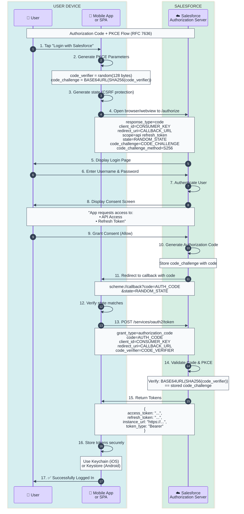

# Authorization Code + PKCE Flow Template

OAuth 2.0 Authorization Code flow with Proof Key for Code Exchange (PKCE) for public clients.

## When to Use
- Single Page Applications (SPAs)
- Mobile native applications
- Desktop applications
- Any client that cannot securely store a client_secret

## Mermaid Template



## ASCII Fallback Template

```
┌──────────┐     ┌───────────────┐     ┌────────────────────┐
│  User    │     │  Mobile App   │     │     Salesforce     │
│          │     │   or SPA      │     │   (Auth Server)    │
└────┬─────┘     └───────┬───────┘     └─────────┬──────────┘
     │                   │                       │
     │  1. Tap Login     │                       │
     │──────────────────>│                       │
     │                   │                       │
     │                   │  2. Generate PKCE:    │
     │                   │     code_verifier     │
     │                   │     code_challenge    │
     │                   │                       │
     │  3. Open Browser/WebView to /authorize    │
     │<──────────────────│                       │
     │                   │                       │
     │  4. GET /authorize                        │
     │      (client_id, code_challenge, state)   │
     │───────────────────────────────────────────────────────>│
     │                   │                       │
     │           5. Login Page                   │
     │<───────────────────────────────────────────────────────│
     │                   │                       │
     │  6. Enter Credentials                     │
     │───────────────────────────────────────────────────────>│
     │                   │                       │
     │           7. Consent Screen               │
     │<───────────────────────────────────────────────────────│
     │                   │                       │
     │  8. Grant Consent                         │
     │───────────────────────────────────────────────────────>│
     │                   │                       │
     │  9. Redirect with ?code=ABC123            │
     │<───────────────────────────────────────────────────────│
     │                   │                       │
     │ 10. Deliver Code  │                       │
     │──────────────────>│                       │
     │                   │                       │
     │                   │ 11. POST /token       │
     │                   │     (code_verifier)   │
     │                   │──────────────────────>│
     │                   │                       │
     │                   │ 12. Verify PKCE:      │
     │                   │     SHA256(verifier)  │
     │                   │     == challenge      │
     │                   │                       │
     │                   │ 13. Access Token +    │
     │                   │     Refresh Token     │
     │                   │<──────────────────────│
     │                   │                       │
     │ 14. Logged In ✅  │                       │
     │<──────────────────│                       │
```

## PKCE Parameter Generation

### JavaScript/TypeScript
```javascript
// Generate code_verifier (43-128 characters)
const codeVerifier = base64URLEncode(crypto.getRandomValues(new Uint8Array(32)));

// Generate code_challenge
const encoder = new TextEncoder();
const data = encoder.encode(codeVerifier);
const digest = await crypto.subtle.digest('SHA-256', data);
const codeChallenge = base64URLEncode(new Uint8Array(digest));

function base64URLEncode(buffer) {
  return btoa(String.fromCharCode(...buffer))
    .replace(/\+/g, '-')
    .replace(/\//g, '_')
    .replace(/=+$/, '');
}
```

### Python
```python
import hashlib
import base64
import secrets

# Generate code_verifier
code_verifier = base64.urlsafe_b64encode(secrets.token_bytes(32)).rstrip(b'=').decode()

# Generate code_challenge
code_challenge = base64.urlsafe_b64encode(
    hashlib.sha256(code_verifier.encode()).digest()
).rstrip(b'=').decode()
```

## Key Differences from Standard Auth Code

| Aspect | Standard | PKCE |
|--------|----------|------|
| Client Secret | Required | Not required |
| code_challenge | Not used | Required in /authorize |
| code_verifier | Not used | Required in /token |
| Security | Secret-based | Cryptographic proof |
| Client Type | Confidential | Public |

## Security Considerations

1. **Generate new PKCE values** for each authorization request
2. **Use S256 method** (SHA-256), never "plain"
3. **Store code_verifier securely** until token exchange
4. **Use secure storage** for tokens (Keychain/Keystore)
5. **Implement refresh token rotation** for additional security

## Customization Points

Replace these placeholders:
- `CONSUMER_KEY` → Your Connected App's Consumer Key
- `CALLBACK_URL` → Your registered callback URL (custom scheme for mobile)
- `CODE_VERIFIER` → Generated 43-128 character random string
- `CODE_CHALLENGE` → BASE64URL(SHA256(CODE_VERIFIER))
