# User-Agent with Social Sign-On Flow Template

OAuth 2.0 User-Agent flow combined with Social Sign-On (OIDC), where Salesforce acts as both the Authorization Provider (for the client) and the Relying Party (to the external OIDC Provider like Facebook, Google, etc.).

## When to Use
- Mobile apps or SPAs requiring social login (Google, Facebook, etc.)
- When Salesforce is an intermediary between your app and social identity providers
- User-Agent flow (implicit-like) with external OIDC authentication
- Silent re-authentication scenarios (OP session cookies)

## Mermaid Template

```mermaid
%%{init: {'theme': 'base', 'themeVariables': {
  'actorBkg': '#ddd6fe',
  'actorTextColor': '#1f2937',
  'actorBorder': '#6d28d9',
  'signalColor': '#334155',
  'signalTextColor': '#1f2937',
  'noteBkgColor': '#f8fafc',
  'noteTextColor': '#1f2937',
  'noteBorderColor': '#334155'
}}}%%
sequenceDiagram
    autonumber

    box rgba(165,243,252,0.3) CLIENT
        participant C as 📱 Client<br/>(Mobile App)
    end

    box rgba(221,214,254,0.3) SALESFORCE
        participant SF as ☁️ Salesforce<br/>(Auth Provider /<br/>Relying Party)
    end

    box rgba(254,215,170,0.3) OIDC PROVIDER
        participant OP as 🔐 OIDC Provider<br/>(Google/Facebook)
    end

    Note over C,OP: User-Agent Flow with Social Sign-On (OIDC)

    %% Phase 1: Initial Access Token Request
    C->>SF: 📤 Access Token Request
    Note over C,SF: GET /services/oauth2/authorize<br/>client_id, response_type=token<br/>redirect_uri, state, scope

    SF->>SF: ⚙️ Check for RP session

    %% Phase 2: Redirect to OIDC Provider
    SF->>C: 📥 HTTP Redirect to OP
    Note over SF,C: Redirect to OIDC authorize endpoint

    C->>OP: 📤 Auth Code Request
    Note over C,OP: GET /authorize<br/>response_type=code<br/>redirect_uri=/services/authglobalcallback<br/>scope, state

    %% Phase 3: Authentication at OP
    OP->>OP: ⚙️ Check for OP session
    OP->>C: 📥 Display Login Page
    C->>OP: 🔐 User authenticates

    OP->>OP: ⚙️ Validate credentials
    OP->>C: 📥 Display Consent Screen (first time only)
    C->>OP: 🔐 User grants consent

    OP->>OP: ⚙️ Generate authorization code

    %% Phase 4: Return to Salesforce
    OP->>C: 📥 HTTP Redirect to Salesforce
    Note over OP,C: Redirect to /services/authglobalcallback<br/>?code=OP_AUTH_CODE&state=...

    C->>SF: 📤 Deliver OP Auth Code
    Note over C,SF: GET /services/authglobalcallback<br/>code=OP_AUTH_CODE, state

    %% Phase 5: Salesforce exchanges code with OP
    SF->>OP: 📤 Access Token Request
    Note over SF,OP: POST to OP Token Endpoint<br/>client_id, client_secret<br/>code, redirect_uri, state

    OP->>OP: ⚙️ Validate client & code

    OP-->>SF: 📥 Access Token Response
    Note over OP,SF: id_token (JWT)<br/>access_token<br/>refresh_token

    SF->>SF: 🔐 Verify ID token signature

    %% Phase 6: Optional UserInfo
    rect rgba(248,250,252,0.5)
        Note over SF,OP: Optional: UserInfo Endpoint
        SF->>OP: 📤 Request User Information
        Note over SF,OP: POST /userinfo<br/>Authorization: Bearer ACCESS_TOKEN
        OP-->>SF: 📥 User Info Response
        Note over OP,SF: User claims (email, name, etc.)
        SF->>SF: 🔐 Validate sub matches ID token
    end

    %% Phase 7: Salesforce User Provisioning
    SF->>SF: ⚙️ Invoke registration handler<br/>to create/update user

    %% Phase 8: User Authorization for Salesforce
    SF->>C: 📥 Display Salesforce Consent
    Note over SF,C: "App requests:<br/>• API Access<br/>• Refresh Token"
    C->>SF: 🔐 User grants Salesforce consent

    %% Phase 9: Return tokens to Client
    SF->>C: 📥 Redirect to Client Callback
    Note over SF,C: Redirect URI with:<br/>access_token (Salesforce)<br/>refresh_token<br/>instance_url

    C->>C: ⚙️ Store Salesforce tokens

    %% Phase 10: API Usage
    C->>SF: 📤 Use Salesforce APIs
    Note over C,SF: Authorization: Bearer SF_ACCESS_TOKEN

    SF-->>C: ✅ API Response

    Note over C,SF: ⚠️ OP session cookie enables<br/>silent re-auth (~15 min)
```



## ASCII Fallback Template

```
┌────────────────┐     ┌────────────────────┐     ┌─────────────────────┐
│     Client     │     │    Salesforce      │     │   OIDC Provider     │
│  (Mobile App)  │     │ (Auth/RP Server)   │     │  (Google/Facebook)  │
└───────┬────────┘     └─────────┬──────────┘     └──────────┬──────────┘
        │                        │                           │
        │  1. Access Token Req   │                           │
        │    (response_type=     │                           │
        │     token)             │                           │
        │───────────────────────>│                           │
        │                        │                           │
        │  2. Redirect to OP     │                           │
        │<───────────────────────│                           │
        │                        │                           │
        │  3. Auth Code Request (response_type=code)         │
        │────────────────────────────────────────────────────>│
        │                        │                           │
        │           4. Login Page                            │
        │<────────────────────────────────────────────────────│
        │                        │                           │
        │  5. Enter Credentials (authenticate)               │
        │────────────────────────────────────────────────────>│
        │                        │                           │
        │           6. Consent Screen (first time)           │
        │<────────────────────────────────────────────────────│
        │                        │                           │
        │  7. Grant Consent                                  │
        │────────────────────────────────────────────────────>│
        │                        │                           │
        │  8. Redirect with ?code=OP_AUTH_CODE               │
        │<────────────────────────────────────────────────────│
        │                        │                           │
        │  9. Deliver OP Code    │                           │
        │───────────────────────>│                           │
        │                        │                           │
        │                        │  10. POST Token Request   │
        │                        │      (code, secret)       │
        │                        │──────────────────────────>│
        │                        │                           │
        │                        │  11. ID Token + Access    │
        │                        │      Token Response       │
        │                        │<──────────────────────────│
        │                        │                           │
        │                        │  [Optional: UserInfo]     │
        │                        │  12. GET /userinfo        │
        │                        │──────────────────────────>│
        │                        │                           │
        │                        │  13. User Claims          │
        │                        │<──────────────────────────│
        │                        │                           │
        │                        │  14. Registration Handler │
        │                        │      (create/update user) │
        │                        ├─────────────┐             │
        │                        │             │             │
        │                        │<────────────┘             │
        │                        │                           │
        │  15. SF Consent Screen │                           │
        │<───────────────────────│                           │
        │                        │                           │
        │  16. Grant SF Consent  │                           │
        │───────────────────────>│                           │
        │                        │                           │
        │  17. Redirect with     │                           │
        │      SF Access Token   │                           │
        │      + Refresh Token   │                           │
        │<───────────────────────│                           │
        │                        │                           │
        │  18. Call SF APIs      │                           │
        │───────────────────────>│                           │
        │                        │                           │
        │  19. API Response ✅   │                           │
        │<───────────────────────│                           │
```

## Key Concepts

### Dual Role of Salesforce

| Role | Context | Responsibility |
|------|---------|----------------|
| **Authorization Provider** | OAuth flow with Client | Issues access tokens to your app |
| **Relying Party (RP)** | OIDC flow with Social Provider | Consumes ID tokens from Google/Facebook |

### Authentication Endpoints

| System | Endpoint | Purpose |
|--------|----------|---------|
| Salesforce Auth | `/services/oauth2/authorize` | Start User-Agent flow |
| Salesforce Callback | `/services/authglobalcallback` | Receive OP auth code |
| Salesforce Token | `/services/oauth2/token` | (Not used in User-Agent) |
| OP Authorization | Provider-specific | `/authorize` endpoint |
| OP Token | Provider-specific | Exchange code for tokens |
| OP UserInfo | Provider-specific | Get user profile claims |

## Security Considerations

1. **OP Session Cookies** - Enable silent re-authentication (~15 min intervals)
2. **ID Token Validation** - Salesforce verifies JWT signature from OP
3. **Sub Claim Matching** - UserInfo `sub` must match ID token `sub`
4. **State Parameter** - CSRF protection between all parties
5. **Registration Handler** - Custom Apex to map OP user to Salesforce User

## Salesforce Configuration

### Auth. Provider Setup

```
Setup → Auth. Providers → New
├── Provider Type: OpenID Connect (or specific: Google, Facebook)
├── Consumer Key: [From OP Developer Console]
├── Consumer Secret: [From OP Developer Console]
├── Authorize Endpoint: https://provider.com/authorize
├── Token Endpoint: https://provider.com/token
├── User Info Endpoint: https://provider.com/userinfo (optional)
└── Registration Handler: [Your Apex Class]
```

### Registration Handler Example

```apex
public class SocialLoginHandler implements Auth.RegistrationHandler {
    public User createUser(Id portalId, Auth.UserData data) {
        // Map social identity to Salesforce User
        User u = new User();
        u.Username = data.email + '.social';
        u.Email = data.email;
        u.FirstName = data.firstName;
        u.LastName = data.lastName;
        // ... additional mapping
        return u;
    }

    public void updateUser(Id userId, Id portalId, Auth.UserData data) {
        // Update existing user on subsequent logins
        User u = [SELECT Id FROM User WHERE Id = :userId];
        u.Email = data.email;
        update u;
    }
}
```

## Token Types

| Token | Issued By | Purpose |
|-------|-----------|---------|
| OP Auth Code | OIDC Provider | Short-lived, exchanged by SF |
| OP ID Token | OIDC Provider | JWT with user identity claims |
| OP Access Token | OIDC Provider | Used by SF to call OP UserInfo |
| SF Access Token | Salesforce | Used by Client to call SF APIs |
| SF Refresh Token | Salesforce | Long-lived, refresh SF access |

## Customization Points

Replace these placeholders:
- `CLIENT_ID` → Your Connected App's Consumer Key
- `CALLBACK_URL` → Your registered callback URL
- `OP_CLIENT_ID` → Consumer Key from Social Provider
- `OP_CLIENT_SECRET` → Consumer Secret from Social Provider

## Reference

- [Salesforce Identity: User-Agent with Social Sign-On](https://cloudsundial.com/salesforce-identity/user-agent-with-social-sign-on)
- [OpenID Connect Core 1.0](https://openid.net/specs/openid-connect-core-1_0.html)
- [Salesforce Auth. Providers Documentation](https://help.salesforce.com/s/articleView?id=sf.sso_provider_openidconnect.htm)
