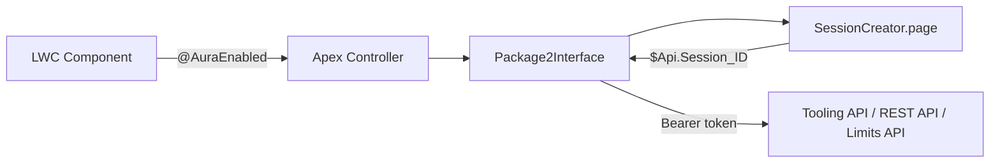
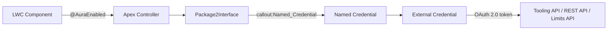

# Named Credentials + External Client App for Tooling API

## Current Architecture

The Package Visualizer (`pkgviz` namespace, 2GP managed package) makes **same-org** HTTP callouts to three API families:

- **Tooling API** (query + PATCH) -- `Package2Interface.cls`
- **REST API** (POST, PATCH, composite) -- `PushUpgradesInterface.cls`
- **Limits API** (GET) -- `LimitsController.cls`

All three use the same auth pattern: `Package2Interface.getSessionId()` renders `SessionCreator.page` (a VF page exposing `$Api.Session_ID` as JSON), extracts the bearer token, and attaches it to every `HttpRequest`.




### Files that make HTTP callouts today


| File                                                                                  | APIs Called                                        | Session Source                     |
| ------------------------------------------------------------------------------------- | -------------------------------------------------- | ---------------------------------- |
| [Package2Interface.cls](force-app/main/default/classes/Package2Interface.cls)         | Tooling query (GET), Tooling sobjects PATCH        | `getSessionId()` -- self           |
| [PushUpgradesInterface.cls](force-app/main/default/classes/PushUpgradesInterface.cls) | REST sobjects POST, composite POST, sobjects PATCH | `Package2Interface.getSessionId()` |
| [LimitsController.cls](force-app/main/default/classes/LimitsController.cls)           | REST limits GET                                    | `Package2Interface.getSessionId()` |


### Endpoints used (all same-org)

- `{orgBaseUrl}/services/data/v61.0/tooling/query?q=...`
- `{orgBaseUrl}/services/data/v61.0/tooling/sobjects/{object}/{id}/`
- `{orgBaseUrl}/services/data/v61.0/limits/`
- `{orgBaseUrl}/services/data/v57.0/sobjects/PackagePushRequest`
- `{orgBaseUrl}/services/data/v57.0/composite/sobjects`
- `{orgBaseUrl}/services/data/v57.0/sobjects/PackagePushRequest/{id}`

---

## Target Architecture




The Named Credential handles token acquisition, refresh, and injection automatically. Apex code sets `req.setEndpoint('callout:PkgViz_DevHub_API/...')` and the platform injects the `Authorization` header.

---

## Step-by-Step Plan

### Step 1: Create the External Client App (Setup UI)

An **External Client App** is a Salesforce-native replacement for the legacy Connected App OAuth setup. It provides the OAuth client that the External Credential will use.

**What to configure (in the DevHub org via Setup):**

- **Name:** `Package Visualizer API` (API Name: `Package_Visualizer_API`)
- **OAuth Settings:**
  - **Callback URL:** `https://{your-org-domain}/services/oauth2/callback` (standard for same-org)
  - **Selected OAuth Scopes:** `api` (REST/Tooling access), `refresh_token` (for token refresh)
  - **Require Proof Key for Code Exchange (PKCE):** Disabled (not needed for server-to-server same-org)
- **Distribution:** "Admins Only" (this app is internal to the DevHub)

**Why External Client App over legacy Connected App:** External Client Apps are the modern replacement (GA since Winter '25). They integrate natively with External Credentials and Named Credentials, support the new credential framework, and are the path forward for packageable OAuth configuration.

**Packaging consideration:** External Client App metadata (`ExternalClientApp`) is packageable in 2GP. However, for the initial analysis, consider whether this should be created manually per-org (via setup instructions in documentation) or packaged. Packaging it means every installer gets a pre-configured OAuth client, but the callback URL must be dynamic (use `{!$Credential.OAuthRedirectUri}` or relative paths).

### Step 2: Create the External Credential Metadata

The External Credential defines the authentication protocol. For same-org Tooling API access, use **OAuth 2.0 with the "Named Principal" identity type**, which means a single integration user's tokens are shared across all users who have access via the permission set.

**Metadata file:** `force-app/main/default/externalCredentials/PkgViz_DevHub.externalCredential-meta.xml`

**Key decisions to analyze:**

- **Authentication Protocol:** `Oauth` (platform-managed OAuth 2.0)
- **Identity Type -- Named Principal vs. Per User:**
  - **Named Principal:** One admin authorizes once; all users share that identity. Simpler but all callouts run as the authorizing user.
  - **Per User:** Each user authorizes individually. More secure (least privilege) but requires every user to complete an OAuth flow. Tooling API queries return data scoped to that user's permissions.
  - **Recommendation for analysis:** Named Principal is simpler for a managed package, but Per User better respects individual user permissions on packaging objects. The current VF session pattern is effectively "Per User" since it uses the running user's session.
- **External Client App Reference:** Points to the External Client App created in Step 1
- **Scopes:** `api refresh_token`

### Step 3: Create the Named Credential Metadata

The Named Credential provides the callable endpoint that Apex code references.

**Metadata file:** `force-app/main/default/namedCredentials/PkgViz_DevHub_API.namedCredential-meta.xml`

**Key configuration:**

- **URL:** This must point to the **current org's own domain**. For a packaged solution, you cannot hard-code the URL. Options:
  - Use a **relative URL** (e.g., just `/services/data`) -- Named Credentials support this for same-org callouts when the URL is set to the org's My Domain.
  - Use a **formula-based URL** via `{!$Credential.Endpoint}` -- but this requires post-install configuration.
  - **Critical decision:** Since Package Visualizer is installed on different DevHub orgs, the URL must be dynamically resolved. The recommended approach is to set the Named Credential URL to the org's own My Domain URL during post-install setup (documented for the admin), or use the `Url.getOrgDomainUrl()` pattern.
- **External Credential:** References `PkgViz_DevHub`
- **Generate Authorization Header:** `true` (the platform auto-injects `Authorization: Bearer {token}`)

### Step 4: Create Permission Set Additions for External Credential Access

Users need permission to use the External Credential. This is granted via the existing `Package_VisualizerPS` permission set.

**What to add to [Package_VisualizerPS.permissionset-meta.xml](force-app/main/default/permissionsets/Package_VisualizerPS.permissionset-meta.xml):**

- `externalCredentialPrincipalAccess` entry granting access to the External Credential's named principal

### Step 5: Refactor Apex to Use Named Credential Endpoint (Future -- Not Yet)

This step is documented for completeness but will **not** be implemented until you decide to proceed. The refactoring would:

- **In `Package2Interface.cls`:**
  - Replace `getBaseURL('tooling')` with `'callout:PkgViz_DevHub_API/services/data/v65.0/tooling/'`
  - Remove the `req.setHeader('Authorization', 'Bearer ' + getSessionId())` lines (Named Credential auto-injects this)
  - Keep `getSessionId()` and `SessionCreator.page` intact as a **fallback** until fully validated
- **In `PushUpgradesInterface.cls`:**
  - Replace `getBaseURL()` with `'callout:PkgViz_DevHub_API/services/data/v65.0/'`
  - Remove `Authorization` header lines
  - Update from v57.0 to v65.0 at the same time (addresses improvement 1.1)
- **In `LimitsController.cls`:**
  - Replace endpoint with `'callout:PkgViz_DevHub_API/services/data/v65.0/limits/'`
  - Remove `Authorization` header line

### Step 6: Update Remote Site Settings

Currently, `SalesforceTrust.remoteSite-meta.xml` only covers `api.status.salesforce.com`. The Tooling/REST callouts work today because the VF session approach doesn't require a Remote Site for same-org calls. With Named Credentials, the platform handles the endpoint trust automatically -- **no Remote Site Setting is needed** for Named Credential-based callouts. This is an advantage.

---

## Key Decision Points to Analyze Before Building

### Decision 1: Named Principal vs. Per User


| Factor                      | Named Principal                         | Per User                              |
| --------------------------- | --------------------------------------- | ------------------------------------- |
| User experience             | Admin authorizes once                   | Every user must complete OAuth        |
| Security model              | All callouts as one identity            | Respects individual user permissions  |
| Current behavior match      | No -- today each user's session is used | Yes -- mirrors the VF session pattern |
| Packaging simplicity        | Simpler                                 | Requires user-facing OAuth flow       |
| Tooling API data visibility | All users see same data                 | Per-user scoping                      |


**Impact:** Package Visualizer queries `Package2`, `PackageSubscriber`, `Package2Version` via Tooling API. These are DevHub-level objects. If all DevHub admins should see the same data, Named Principal suffices. If different users should see different packages based on their org-level permissions, Per User is needed.

### Decision 2: Packageable vs. Post-Install Setup


| Component              | Can Package? | Notes                                                  |
| ---------------------- | ------------ | ------------------------------------------------------ |
| External Client App    | Yes (2GP)    | But callback URL must be configurable per org          |
| External Credential    | Yes (2GP)    | Auth protocol and identity type are fixed              |
| Named Credential       | Yes (2GP)    | URL must be set post-install to match the org's domain |
| Permission Set entries | Yes (2GP)    | Straightforward addition                               |


**Key constraint:** The Named Credential URL pointing to the org's own domain cannot be hard-coded in a managed package that installs on many different orgs. Options:

1. Package with a **placeholder URL** and document that the admin must update it post-install
2. Package with a **relative URL** (if the platform supports it for same-org -- needs verification)
3. Don't package the Named Credential; instead, provide a post-install script or setup guide
4. Use a **Custom Metadata Type** to store the Named Credential developer name, so the Apex code can dynamically resolve it

### Decision 3: Coexistence Strategy (Dual-Path)

Since `SessionCreator.page` is being kept, consider a **dual-path** approach during the transition:

```apex
public static String getAuthToken() {
    try {
        // Try Named Credential first (modern path)
        HttpRequest probe = new HttpRequest();
        probe.setEndpoint('callout:PkgViz_DevHub_API/services/data/v65.0/limits/');
        probe.setMethod('GET');
        Http h = new Http();
        HttpResponse res = h.send(probe);
        if (res.getStatusCode() == 200) {
            return null; // Named Credential handles auth; no token needed
        }
    } catch (Exception e) {
        // Named Credential not configured; fall back to VF session
    }
    return getSessionId(); // Legacy fallback
}
```

Or simpler: use a Custom Metadata Type flag (`Use_Named_Credentials__c`) to toggle between paths, letting admins opt in.

### Decision 4: API Version Standardization

If you refactor the endpoints, standardize on **v65.0** across all three classes (currently v61.0 for Tooling/Limits and v57.0 for Push Upgrades). This addresses plan item 1.1 simultaneously.

---

## Files That Will Be Created or Modified

**New metadata files (Step 1-3):**

- `force-app/main/default/externalCredentials/PkgViz_DevHub.externalCredential-meta.xml`
- `force-app/main/default/namedCredentials/PkgViz_DevHub_API.namedCredential-meta.xml`
- Optionally: `force-app/main/default/externalClientApps/Package_Visualizer_API.externalClientApp-meta.xml`

**Modified files (Step 4):**

- [Package_VisualizerPS.permissionset-meta.xml](force-app/main/default/permissionsets/Package_VisualizerPS.permissionset-meta.xml) -- add external credential access

**Future modified files (Step 5, deferred):**

- [Package2Interface.cls](force-app/main/default/classes/Package2Interface.cls) -- refactor `submitQuery()`, `updatePackage2Fields()`, `getBaseURL()`
- [PushUpgradesInterface.cls](force-app/main/default/classes/PushUpgradesInterface.cls) -- refactor all HTTP methods
- [LimitsController.cls](force-app/main/default/classes/LimitsController.cls) -- refactor `getLimits()`
- Test classes and mocks -- update to work with `callout:` endpoints

---

## Post-Install Admin Steps (Documentation to Write)

Since this is a managed package installed on customer DevHub orgs, clear post-install documentation is essential:

1. Navigate to Setup > Named Credentials
2. Edit `PkgViz DevHub API`
3. Set the URL to `https://{your-my-domain}.my.salesforce.com`
4. Under the External Credential, click "Authenticate" to complete the OAuth flow
5. Verify by navigating to the Package Visualizer app and loading the package list

