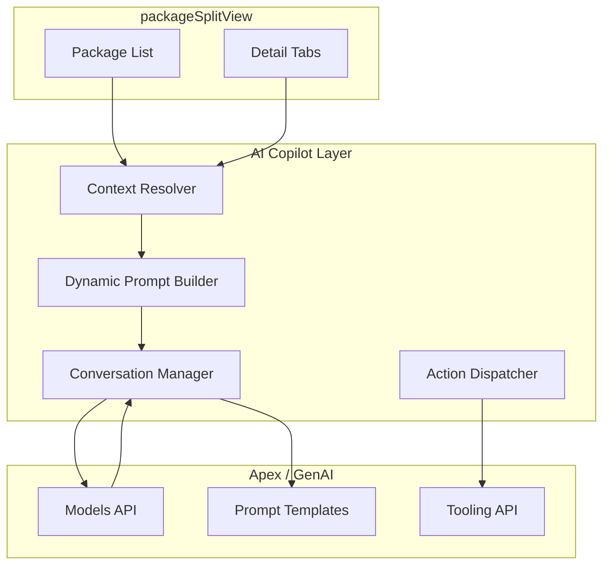

# Reimagining the Agentforce Experience for ISV Admins

## Current State

The existing implementation is a **single-turn, static Q&A modal**:

- A button in the `packageSplitView` header fires `openAskAgentforce()` which opens `agentforcePromptModalGenerator` with a hard-coded prompt: *"How to develop and use Second-Generation Packaging (2GP) in Salesforce?"*
- The modal sends one prompt to the Models API, renders the response as rich text, and lets the user "Ask Again" or switch models
- There is **no context awareness** -- the AI has no idea which package, version, subscriber, or error the user is looking at
- There is **no conversation memory** -- each interaction is isolated
- There is **no action capability** -- the AI can only produce text

The same pattern is repeated in `packagePushJobDetail` (error diagnosis) and `scratchBuildModal` (scratch def generation), each with its own hard-coded prompts.

---

## Proposed Architecture: Context-Aware AI Copilot

Replace the modal-centric approach with a **persistent, context-aware AI copilot** that lives inside the tool and adapts to what the ISV admin is doing.




---

## Idea 1: Context-Aware Smart Prompts (Quick Win)

**Problem:** The current button always asks the same generic 2GP question regardless of context.

**Solution:** The `openAskAgentforce` method already receives `event.target.value` as a context key (`"packagesOverview"`). Expand this so every tab/view passes its own context + live data into the prompt.

**Where to change:** [packageSplitView.js](force-app/main/default/lwc/packageSplitView/packageSplitView.js) `openAskAgentforce()` and [agentforcePromptModalGenerator.js](force-app/main/default/lwc/agentforcePromptModalGenerator/agentforcePromptModalGenerator.js)

**How it works:**

- Move the Agentforce button from the static header **into each tab** (Details, Versions, Subscribers, Push Requests)
- Each tab sends its current data as structured context:

```javascript
// In packageVersionsView -- when user clicks "Ask Agentforce"
openAskAgentforce() {
  this.openModal({
    headerLabel: "Ask Agentforce",
    context: "packageVersions",
    contextData: {
      packageName: this.name,
      packageType: this.packageType,
      totalVersions: this.versions.length,
      latestVersion: this.versions[0],
      codeCoverage: this.versions[0]?.codeCoverage
    },
    suggestedPrompts: [
      "Summarize the version history and release cadence for this package",
      "Which versions should I consider deprecating?",
      "Is the latest version ready for a push upgrade?"
    ]
  });
}
```

**Dynamic prompt templates by context:**

- **Package Overview**: "I have {count} packages ({managed} managed, {unlocked} unlocked). Summarize my packaging portfolio health."
- **Package Details**: "Package '{name}' (namespace: {ns}) was created on {date}. It has {versionCount} versions and {subscriberCount} subscribers. What should I focus on?"
- **Versions Tab**: "The latest version of '{name}' is {version} with {coverage}% code coverage. The previous version was released {daysAgo} days ago. Analyze release readiness."
- **Subscribers Tab**: "Package '{name}' has {count} subscribers. {outdatedCount} are on versions older than {latestVersion}. Recommend an upgrade strategy."
- **Push Upgrades Tab**: "The last push request targeted {count} orgs. {failedCount} failed with errors. Analyze the failure pattern and suggest remediation."

---

## Idea 2: Conversational Multi-Turn Copilot (Replace Modal with Docked Panel)

**Problem:** The modal blocks the UI, has no memory, and feels disconnected from the workflow.

**Solution:** Replace `agentforcePromptModalGenerator` (LightningModal) with a **docked utility bar copilot** or an **inline panel** that persists across navigation, maintains conversation history, and lets the user drill deeper.

**Where to change:** New component (e.g., `agentforceCopilotPanel`) registered in [dockedUtilityBar](force-app/main/default/lwc/dockedUtilityBar/) or as a new inline panel in `packageSplitView`

**Key capabilities:**

- **Conversation history** stored in component state (array of `{role, content, timestamp}`)
- **Context injection** on every message: the system prompt is dynamically rebuilt with the current package/version/subscriber data each turn
- **Follow-up awareness**: "You mentioned 3 at-risk subscribers. Which ones?" works because the AI sees the prior exchange
- **Persist across tab switches**: Unlike a modal, the copilot stays open as you navigate between Details/Versions/Subscribers tabs

**UX sketch:**

```
+-------------------------------------------+
| [icon] Agentforce Copilot           [_][X]|
+-------------------------------------------+
| You're viewing: Acme Package (Managed)    |
| 45 versions | 258 subscribers             |
+-------------------------------------------+
| [Suggested]                               |
| [Summarize package health]                |
| [Plan a push upgrade]                     |
| [Analyze subscriber distribution]         |
+-------------------------------------------+
| User: Summarize package health            |
| Agent: Acme Package looks healthy...      |
|   - Latest version: 8.10 (95% coverage)  |
|   - 12 subscribers on outdated versions   |
|   - Push success rate: 97%               |
| User: Tell me more about those 12        |
| Agent: Here's the breakdown by version... |
+-------------------------------------------+
| [Type a message...]            [Send] [+] |
+-------------------------------------------+
```

---

## Idea 3: AI-Powered Push Upgrade Planner (Agentic Workflow)

**Problem:** Planning a push upgrade is a multi-step manual process -- ISV admins must check subscriber versions, pick target version, decide rollout order, handle failures, and communicate with customers.

**Solution:** A guided, multi-step AI workflow triggered from the Subscribers or Push Requests tab.

**Where to change:** New component `agentforcePushPlanner` invoked from [packagePushUpgradesView](force-app/main/default/lwc/packagePushUpgradesView/) and [packageVersionSubscriberPushUpgrade](force-app/main/default/lwc/packageVersionSubscriberPushUpgrade/)

**Step-by-step flow:**

1. **Analysis** -- AI reads subscriber data (org types, current versions, instance names, statuses) and generates:
  - Subscriber segmentation (sandbox vs. production, by instance, by version lag)
  - Risk assessment per segment
  - Recommended rollout phases
2. **Strategy** -- AI proposes a phased plan:
  - "Phase 1: Push to 15 sandbox orgs on NA instances (low risk)"
  - "Phase 2: Push to 45 production orgs on NA instances after 48h soak"
  - "Phase 3: Push to 12 EMEA production orgs"
  - User can adjust phases, exclude orgs, modify timing
3. **Communication** -- AI drafts:
  - Pre-upgrade notification email (per segment)
  - Release notes summary
  - Post-upgrade confirmation
4. **Monitoring** -- Once push jobs are created, AI monitors status and:
  - Highlights failures in real-time
  - Diagnoses errors (leveraging existing `pushJobError` data from [packagePushJobDetail](force-app/main/default/lwc/packagePushJobDetail/packagePushJobDetail.js))
  - Suggests whether to retry, skip, or escalate
  - Generates post-push summary report

---

## Idea 4: Proactive AI Insights Banner

**Problem:** The AI only activates when the user clicks a button. It should surface insights proactively.

**Solution:** Add an AI-generated insights banner to the package detail view that runs a lightweight analysis on page load.

**Where to change:** New child component in [packageDetailsView](force-app/main/default/lwc/packageDetailsView/) or as a slot in [packageHeader](force-app/main/default/lwc/packageHeader/)

**Examples of proactive insights:**

- "3 subscribers are running a version that was deprecated 60 days ago. [View] [Plan upgrade]"
- "Your latest version has 72% code coverage -- below the 75% threshold for managed package release. [Learn more]"
- "Push upgrade failure rate increased 15% this month. Most failures are on AP instances. [Diagnose]"
- "You haven't released a new version in 90 days. Your 12 active subscribers may benefit from a maintenance release. [Start version]"
- "Subscriber 'Contoso Corp' has been in Suspended status for 45 days. [View subscriber] [Draft outreach email]"

The banner would use a lightweight prompt that summarizes package health based on aggregated data already available in the component (subscriber counts, version stats, push history).

---

## Idea 5: Natural Language Query for Package Data

**Problem:** Finding specific information requires navigating through multiple tabs, filters, and drill-downs.

**Solution:** Let the ISV admin ask questions in natural language and get data-driven answers with deep links.

**Examples:**

- "Which subscribers are still on version 7.x?" -> Returns filtered subscriber list with direct links
- "Show me all failed push jobs from last week" -> Navigates to Push Requests tab with date filter applied
- "How many managed vs unlocked packages do I have?" -> Returns counts with package type breakdown
- "What's the install URL for version 8.10.0?" -> Returns the install link directly

**Implementation approach:**

- AI parses the natural language query
- Maps it to existing Apex methods in [PackageVisualizerCtrl](force-app/main/default/classes/PackageVisualizerCtrl.cls) or [Package2Interface](force-app/main/default/classes/Package2Interface.cls)
- Returns structured results with action buttons (navigate, filter, export)
- This could leverage **GenAiFunction** / **GenAiPlugin** metadata (already documented in [setupAssistantAgentforce](force-app/main/default/lwc/setupAssistantAgentforce/)) to create true agentic actions

---

## Idea 6: Error Diagnosis Agent (Enhanced)

**Problem:** The current `packagePushJobDetail` shows raw error text and has a basic "Agentforce Assist" button. Push failures are one of the most painful ISV admin experiences.

**Solution:** A specialized error diagnosis flow that goes beyond just explaining the error.

**Where to change:** Enhance [packagePushJobDetail](force-app/main/default/lwc/packagePushJobDetail/packagePushJobDetail.js) and its Agentforce integration

**Capabilities:**

- **Pattern detection**: "This error (INVALID_FIELD) has occurred in 8 of your 12 failed push jobs. It appears to be related to a field-level security issue in the target orgs."
- **Cross-reference with Trust**: Combine with existing [trustInstanceDetail](force-app/main/default/lwc/trustInstanceDetail/) data -- "Instance NA45 is currently experiencing degraded performance. Consider retrying after the maintenance window."
- **Remediation steps**: Specific, actionable fixes rather than generic documentation links
- **Batch retry suggestions**: "5 of the 8 failures were transient timeouts. Retry these specific orgs: [Retry Selected]"
- **Historical context**: "This package version had a 94% push success rate on NA instances but only 71% on EU instances"

---

## Idea 7: AI-Assisted Subscriber Communication Hub

**Problem:** ISV admins need to communicate with subscribers about upgrades, deprecations, and issues, but there's no integrated communication workflow.

**Solution:** Leverage the existing LMA integration (`packageLmaTimeline` already has template prompts for email) to create a full communication assistant.

**Where to change:** Enhance [packageLmaTimeline](force-app/main/default/lwc/packageLmaTimeline/packageLmaTimeline.js) and add new templates in the AI prompt system

**Capabilities:**

- **Generate contextual emails**: "Draft a push upgrade notification for subscribers on version 7.x" -- AI knows the target version, what changed, and the subscriber segment
- **Multi-language support**: Generate communications in subscriber's locale
- **Tone adjustment**: Professional, casual, urgent (for security patches)
- **Template library**: AI-generated templates stored as custom metadata (extending the existing `Package_Visualizer_Resource__mdt` pattern)
- **Bulk personalization**: Generate personalized emails for each subscriber using their org name, current version, and relationship context

---

## Implementation Priority

### Tier 1 -- High Impact, Low Effort (Context-Aware Quick Wins)

- **Idea 1: Context-aware smart prompts** -- Modify existing `openAskAgentforce` to pass dynamic context and suggested prompts per tab
- **Idea 4: Proactive insights banner** -- Lightweight component that summarizes package health on load

### Tier 2 -- High Impact, Medium Effort (Core Copilot)

- **Idea 2: Multi-turn copilot panel** -- Replace modal with persistent docked panel
- **Idea 6: Enhanced error diagnosis** -- Specialize the push failure AI workflow

### Tier 3 -- Transformational, Higher Effort (Agentic Workflows)

- **Idea 3: Push upgrade planner** -- Multi-step guided workflow
- **Idea 5: Natural language query** -- Requires GenAiFunction/GenAiPlugin wiring
- **Idea 7: Communication hub** -- Extends existing LMA GenAI patterns

---

## Key Files to Modify

- [packageSplitView.js](force-app/main/default/lwc/packageSplitView/packageSplitView.js) -- Context resolution and Agentforce entry points (lines 439-461)
- [agentforcePromptModalGenerator.js](force-app/main/default/lwc/agentforcePromptModalGenerator/agentforcePromptModalGenerator.js) -- Modal logic, evolve to copilot panel
- [agentforcePromptModalGenerator.html](force-app/main/default/lwc/agentforcePromptModalGenerator/agentforcePromptModalGenerator.html) -- Chat UI, add conversation history and suggested prompts
- [PackageVisualizerCtrl.cls](force-app/main/default/classes/PackageVisualizerCtrl.cls) -- GenAI bridge methods (lines 291+), add context-enriched prompt assembly
- [packagePushJobDetail](force-app/main/default/lwc/packagePushJobDetail/) -- Enhanced error diagnosis
- [dockedUtilityBar](force-app/main/default/lwc/dockedUtilityBar/) -- Potential home for persistent copilot panel

