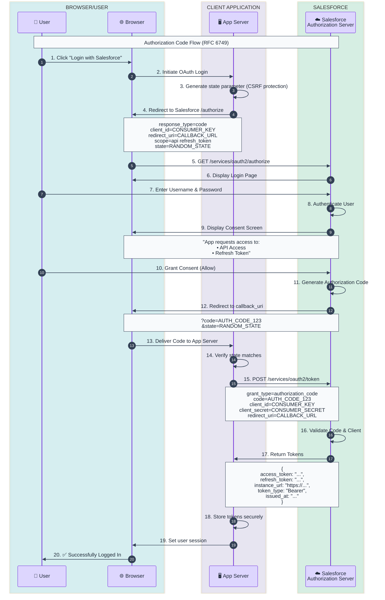

# Authorization Code Flow Template

Standard OAuth 2.0 Authorization Code flow for web applications with backend servers.

## When to Use
- Web applications with secure backend servers
- Confidential clients that can protect client_secret
- When you need refresh tokens for long-lived access

## Mermaid Template



## ASCII Fallback Template

```
┌──────────┐     ┌───────────────┐     ┌────────────────────┐
│  User/   │     │  Application  │     │     Salesforce     │
│  Browser │     │    Server     │     │  (Auth Server)     │
└────┬─────┘     └───────┬───────┘     └─────────┬──────────┘
     │                   │                       │
     │  1. Click Login   │                       │
     │──────────────────>│                       │
     │                   │                       │
     │  2. Redirect to   │                       │
     │     /authorize    │                       │
     │<──────────────────│                       │
     │                   │                       │
     │  3. GET /authorize (client_id, scope, state)         │
     │───────────────────────────────────────────────────────>│
     │                   │                       │
     │           4. Login Page                   │
     │<───────────────────────────────────────────────────────│
     │                   │                       │
     │  5. Enter Credentials                     │
     │───────────────────────────────────────────────────────>│
     │                   │                       │
     │           6. Consent Screen               │
     │<───────────────────────────────────────────────────────│
     │                   │                       │
     │  7. Grant Consent (Allow)                 │
     │───────────────────────────────────────────────────────>│
     │                   │                       │
     │  8. Redirect with ?code=ABC123&state=xyz  │
     │<───────────────────────────────────────────────────────│
     │                   │                       │
     │  9. Deliver Code  │                       │
     │──────────────────>│                       │
     │                   │                       │
     │                   │  10. POST /token      │
     │                   │      (code, secret)   │
     │                   │──────────────────────>│
     │                   │                       │
     │                   │  11. Access Token +   │
     │                   │      Refresh Token    │
     │                   │<──────────────────────│
     │                   │                       │
     │ 12. Logged In ✅  │                       │
     │<──────────────────│                       │
```

## Key Endpoints

| Endpoint | URL | Purpose |
|----------|-----|---------|
| Authorization | `https://login.salesforce.com/services/oauth2/authorize` | Start OAuth flow |
| Token | `https://login.salesforce.com/services/oauth2/token` | Exchange code for tokens |

## Security Considerations

1. **Always use HTTPS** for redirect_uri in production
2. **Validate state parameter** to prevent CSRF attacks
3. **Store client_secret securely** (never in client-side code)
4. **Use short-lived access tokens** with refresh token rotation

## Customization Points

Replace these placeholders:
- `CONSUMER_KEY` → Your Connected App's Consumer Key
- `CONSUMER_SECRET` → Your Connected App's Consumer Secret
- `CALLBACK_URL` → Your registered callback URL
- `RANDOM_STATE` → Cryptographically random state value
