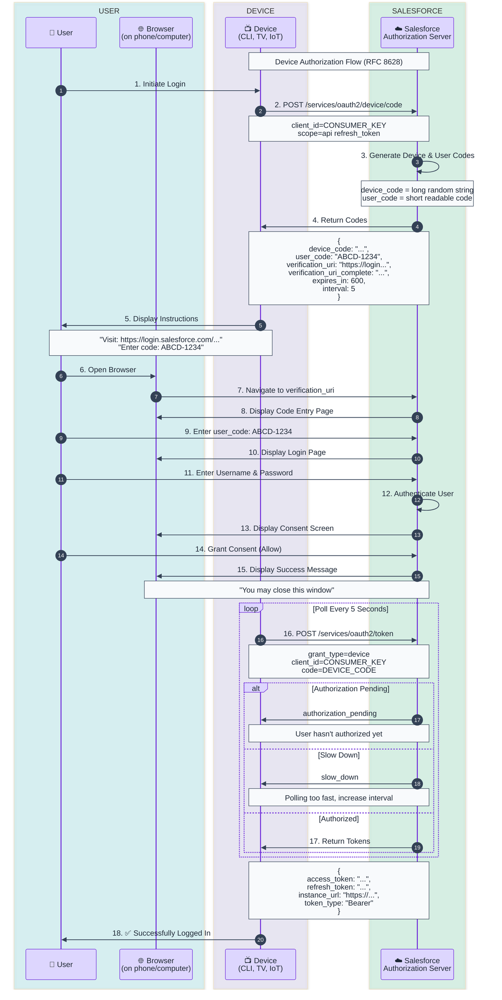

# Device Authorization Flow Template

OAuth 2.0 Device Authorization Grant for input-constrained devices without browsers.

## When to Use
- CLI tools (like Salesforce CLI)
- Smart TVs and streaming devices
- IoT devices
- Gaming consoles
- Any device without a browser or limited input capability

## Mermaid Template



## ASCII Fallback Template

```
┌──────────┐  ┌───────────┐  ┌────────────┐  ┌────────────────┐
│  User    │  │  Browser  │  │   Device   │  │   Salesforce   │
│          │  │(phone/PC) │  │ (CLI/TV)   │  │  (Auth Server) │
└────┬─────┘  └─────┬─────┘  └──────┬─────┘  └───────┬────────┘
     │              │               │                │
     │              │  1. Start     │                │
     │              │     Login     │                │
     │──────────────────────────────>                │
     │              │               │                │
     │              │               │  2. Request    │
     │              │               │     device code│
     │              │               │───────────────>│
     │              │               │                │
     │              │               │  3. device_code│
     │              │               │     user_code  │
     │              │               │     ABCD-1234  │
     │              │               │<───────────────│
     │              │               │                │
     │     4. "Visit URL and enter: ABCD-1234"      │
     │<──────────────────────────────                │
     │              │               │                │
     │  5. Open browser             │                │
     │─────────────>│               │                │
     │              │               │                │
     │              │  6. Visit verification URL     │
     │              │──────────────────────────────>│
     │              │               │                │
     │              │  7. Enter code page           │
     │              │<──────────────────────────────│
     │              │               │                │
     │  8. Enter ABCD-1234          │                │
     │─────────────>│──────────────────────────────>│
     │              │               │                │
     │  9. Login + Consent          │                │
     │─────────────────────────────────────────────>│
     │              │               │                │
     │              │               │  10. Poll for  │
     │              │               │      token     │
     │              │               │  ┌───────────>│
     │              │               │  │            │
     │              │               │  │ (repeat)   │
     │              │               │  │            │
     │              │               │  11. Tokens!  │
     │              │               │<─┴────────────│
     │              │               │                │
     │ 12. Logged In ✅             │                │
     │<──────────────────────────────                │
```

## Step 1: Request Device Code

```bash
curl -X POST https://login.salesforce.com/services/oauth2/device/code \
  -d "client_id=YOUR_CONSUMER_KEY" \
  -d "scope=api refresh_token"
```

### Response
```json
{
  "device_code": "aDEvhqZjZ2FwcAA6y...",
  "user_code": "ABCD-1234",
  "verification_uri": "https://login.salesforce.com/setup/connect",
  "verification_uri_complete": "https://login.salesforce.com/setup/connect?user_code=ABCD-1234",
  "expires_in": 600,
  "interval": 5
}
```

## Step 2: Display to User

```
═══════════════════════════════════════════════════════════════
  To authorize this device, please:

  1. Visit: https://login.salesforce.com/setup/connect
  2. Enter code: ABCD-1234

  Waiting for authorization...
═══════════════════════════════════════════════════════════════
```

## Step 3: Poll for Token

```bash
curl -X POST https://login.salesforce.com/services/oauth2/token \
  -d "grant_type=device" \
  -d "client_id=YOUR_CONSUMER_KEY" \
  -d "code=DEVICE_CODE"
```

### Possible Responses

**Authorization Pending:**
```json
{
  "error": "authorization_pending",
  "error_description": "User has not yet authorized"
}
```

**Slow Down (polling too fast):**
```json
{
  "error": "slow_down",
  "error_description": "Polling too fast"
}
```

**Success:**
```json
{
  "access_token": "00D5g000001ABC...!ARcAQNlBrLGj...",
  "refresh_token": "5Aep8617...",
  "instance_url": "https://mycompany.my.salesforce.com",
  "token_type": "Bearer",
  "issued_at": "1702123456789"
}
```

## Code Example (CLI Tool)

```python
import requests
import time

CLIENT_ID = 'YOUR_CONSUMER_KEY'

# Step 1: Request device code
device_response = requests.post(
    'https://login.salesforce.com/services/oauth2/device/code',
    data={'client_id': CLIENT_ID, 'scope': 'api refresh_token'}
).json()

device_code = device_response['device_code']
user_code = device_response['user_code']
verification_uri = device_response['verification_uri']
interval = device_response['interval']

# Step 2: Display to user
print(f"\nVisit: {verification_uri}")
print(f"Enter code: {user_code}\n")

# Step 3: Poll for token
while True:
    time.sleep(interval)

    token_response = requests.post(
        'https://login.salesforce.com/services/oauth2/token',
        data={
            'grant_type': 'device',
            'client_id': CLIENT_ID,
            'code': device_code
        }
    ).json()

    if 'access_token' in token_response:
        print("✅ Authorization successful!")
        break
    elif token_response.get('error') == 'slow_down':
        interval += 5  # Increase polling interval
    elif token_response.get('error') != 'authorization_pending':
        print(f"Error: {token_response.get('error_description')}")
        break

access_token = token_response['access_token']
```

## Key Characteristics

| Aspect | Value |
|--------|-------|
| User Interaction | On separate device |
| Polling Required | Yes (every N seconds) |
| Refresh Token | Yes, returned |
| Best For | CLI tools, IoT, TVs |
| User Code Format | Short, human-readable |

## Timing Parameters

| Parameter | Value | Purpose |
|-----------|-------|---------|
| `expires_in` | 600 (10 min) | How long codes are valid |
| `interval` | 5 (seconds) | Minimum time between polls |

## Security Considerations

1. **Display user code clearly** - Use large font, easy to read
2. **Honor interval** - Don't poll faster than specified
3. **Handle expiration** - Codes expire after `expires_in` seconds
4. **Secure token storage** - Store tokens securely on device

## Customization Points

Replace these placeholders:
- `CONSUMER_KEY` → Your Connected App's Consumer Key
- `DEVICE_CODE` → Device code from initial response
- `login.salesforce.com` → Or `test.salesforce.com` for sandbox
