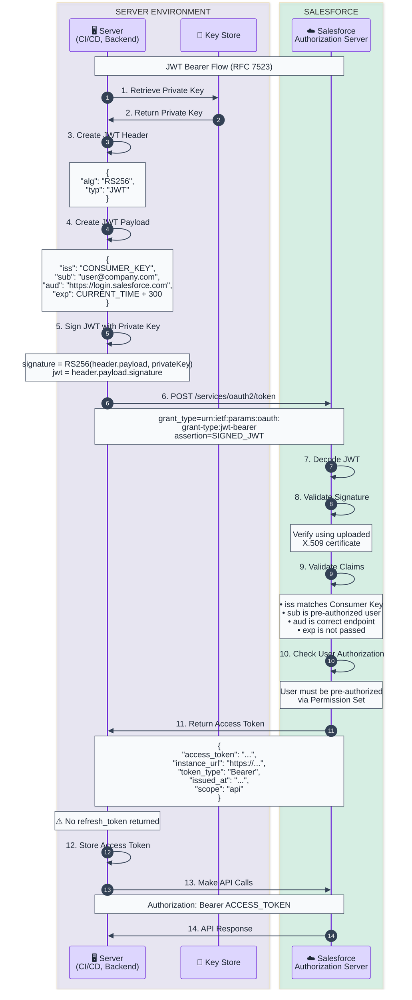

# JWT Bearer Flow Template

OAuth 2.0 JWT Bearer assertion flow for server-to-server authentication without user interaction.

## When to Use
- Server-to-server integrations
- CI/CD pipelines
- Scheduled jobs and automation
- Background processes
- Any headless authentication scenario

## Prerequisites
1. X.509 Certificate uploaded to Salesforce Connected App
2. Pre-authorized user via Permission Set
3. Private key securely stored on server

## Mermaid Template



## ASCII Fallback Template

```
┌───────────────────────┐     ┌────────────────────┐
│     Server/CI/CD      │     │     Salesforce     │
│    (Private Key)      │     │   (Certificate)    │
└───────────┬───────────┘     └─────────┬──────────┘
            │                           │
            │  1. Create JWT Claims     │
            │     iss: consumer_key     │
            │     sub: user@company.com │
            │     aud: login.sf.com     │
            │     exp: now + 5 min      │
            │                           │
            │  2. Sign JWT with         │
            │     Private Key (RS256)   │
            │                           │
            │  3. POST /token           │
            │     (grant_type=jwt-bearer)
            │     (assertion=signed_jwt)│
            │──────────────────────────>│
            │                           │
            │           4. Verify JWT   │
            │              signature    │
            │              with cert    │
            │                           │
            │           5. Validate     │
            │              claims       │
            │                           │
            │           6. Check user   │
            │              pre-auth     │
            │                           │
            │  7. Access Token          │
            │     (NO refresh token!)   │
            │<──────────────────────────│
            │                           │
            │  8. API Request           │
            │     (Bearer token)        │
            │──────────────────────────>│
            │                           │
            │  9. API Response          │
            │<──────────────────────────│
```

## JWT Structure

### Header
```json
{
  "alg": "RS256",
  "typ": "JWT"
}
```

### Payload (Claims)
```json
{
  "iss": "3MVG9...",          // Consumer Key from Connected App
  "sub": "user@company.com",   // Pre-authorized username
  "aud": "https://login.salesforce.com",  // Or test.salesforce.com for sandbox
  "exp": 1702123456            // Expiration (current time + 5 min max)
}
```

### Signature
```
RS256(
  base64URLEncode(header) + "." + base64URLEncode(payload),
  privateKey
)
```

## Token Request

```bash
curl -X POST https://login.salesforce.com/services/oauth2/token \
  -d "grant_type=urn:ietf:params:oauth:grant-type:jwt-bearer" \
  -d "assertion=eyJhbGciOiJSUzI1NiIsInR5cCI6IkpXVCJ9.eyJpc3MiOiIzTVZHOS4uLiIsInN1YiI6InVzZXJAY29tcGFueS5jb20iLCJhdWQiOiJodHRwczovL2xvZ2luLnNhbGVzZm9yY2UuY29tIiwiZXhwIjoxNzAyMTIzNDU2fQ.SIGNATURE"
```

## Code Examples

### Python
```python
import jwt
import time
import requests

private_key = open('server.key').read()

claim_set = {
    'iss': 'YOUR_CONSUMER_KEY',
    'sub': 'user@company.com',
    'aud': 'https://login.salesforce.com',
    'exp': int(time.time()) + 300  # 5 minutes
}

assertion = jwt.encode(claim_set, private_key, algorithm='RS256')

response = requests.post(
    'https://login.salesforce.com/services/oauth2/token',
    data={
        'grant_type': 'urn:ietf:params:oauth:grant-type:jwt-bearer',
        'assertion': assertion
    }
)

access_token = response.json()['access_token']
instance_url = response.json()['instance_url']
```

### Node.js
```javascript
const jwt = require('jsonwebtoken');
const axios = require('axios');
const fs = require('fs');

const privateKey = fs.readFileSync('server.key');

const token = jwt.sign(
  {
    iss: 'YOUR_CONSUMER_KEY',
    sub: 'user@company.com',
    aud: 'https://login.salesforce.com',
    exp: Math.floor(Date.now() / 1000) + 300
  },
  privateKey,
  { algorithm: 'RS256' }
);

const response = await axios.post(
  'https://login.salesforce.com/services/oauth2/token',
  new URLSearchParams({
    grant_type: 'urn:ietf:params:oauth:grant-type:jwt-bearer',
    assertion: token
  })
);

const { access_token, instance_url } = response.data;
```

## Key Characteristics

| Aspect | Value |
|--------|-------|
| User Interaction | None required |
| Refresh Token | **Not returned** - re-authenticate with new JWT |
| Token Lifetime | Default ~2 hours (configurable) |
| Security Model | Certificate-based (asymmetric) |
| Audience | `login.salesforce.com` or `test.salesforce.com` |

## Security Considerations

1. **Protect private key** - Use secrets manager, HSM, or secure vault
2. **Rotate certificates** before expiration
3. **Short JWT expiration** - Maximum 5 minutes recommended
4. **Limit user permissions** - Use dedicated integration user
5. **Monitor token usage** - Set up login history alerts

## Troubleshooting

| Error | Cause | Solution |
|-------|-------|----------|
| `invalid_grant` | JWT expired or invalid | Check exp claim, verify signature |
| `invalid_client` | Consumer key mismatch | Verify iss matches Connected App |
| `user_not_authorized` | User not pre-approved | Assign Permission Set to user |
| `invalid_assertion` | Signature verification failed | Verify certificate upload |

## Customization Points

Replace these placeholders:
- `CONSUMER_KEY` → Your Connected App's Consumer Key
- `user@company.com` → Pre-authorized Salesforce username
- `login.salesforce.com` → Or `test.salesforce.com` for sandbox
